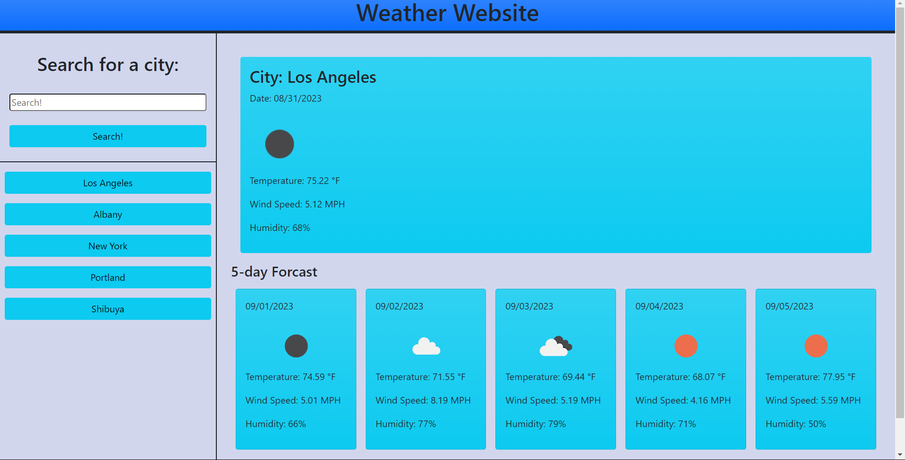

# Weather-Website

## Description

### User Story: 
```
AS A traveler
I WANT to see the weather outlook for multiple cities
SO THAT I can plan a trip accordingly
```
This weather website is to demonstrate the use of web api's and also futher shows the use of creatingelements within the javascript file rather then the html file
## Installations
N/A

## Usage

### Acceptance Criteria:
```
GIVEN a weather dashboard with form inputs
WHEN I search for a city
THEN I am presented with current and future conditions for that city and that city is added to the search history
WHEN I view current weather conditions for that city
THEN I am presented with the city name, the date, an icon representation of weather conditions, the temperature, the humidity, and the the wind speed
WHEN I view future weather conditions for that city
THEN I am presented with a 5-day forecast that displays the date, an icon representation of weather conditions, the temperature, the wind speed, and the humidity
WHEN I click on a city in the search history
THEN I am again presented with current and future conditions for that city
```
This weather app allows the user to save up to 5 previous searches and displays the current days weather and future days weather. This app can be used as a guide to help understand how to use web api's

## Link
https://brandonerivera.github.io/Weather-Website/
## Screenshots
